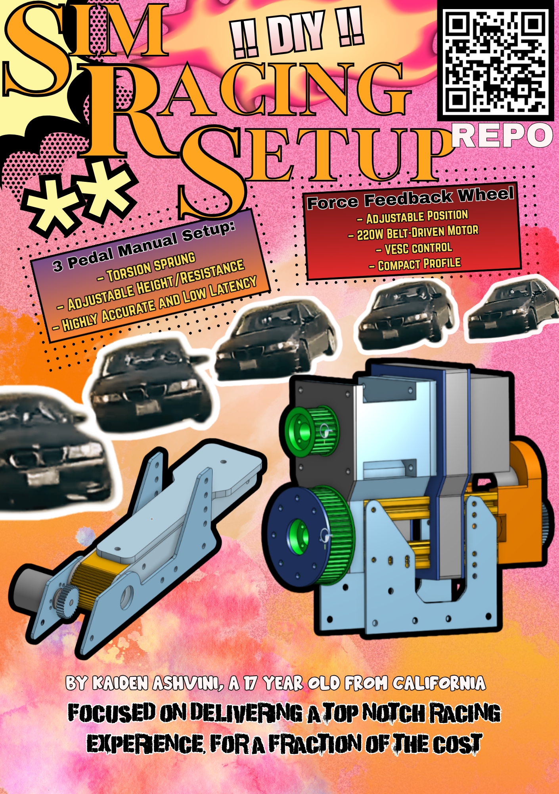
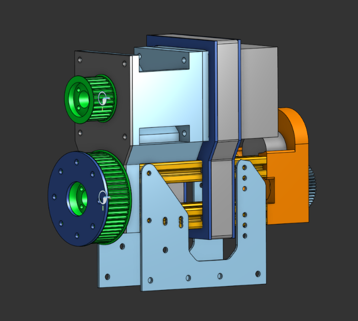
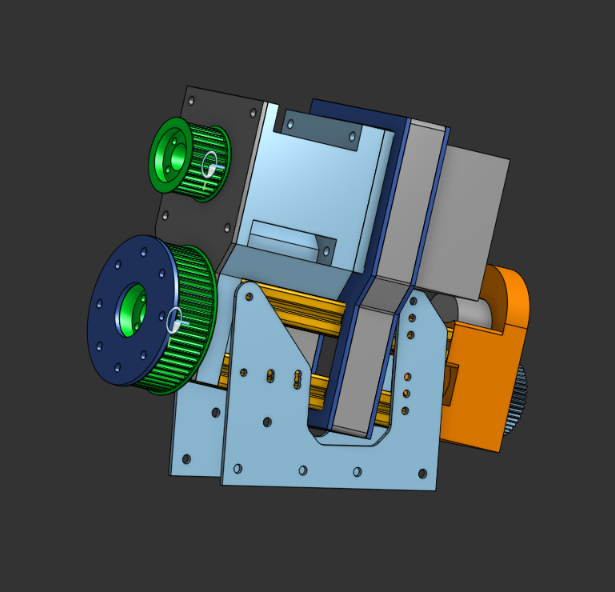
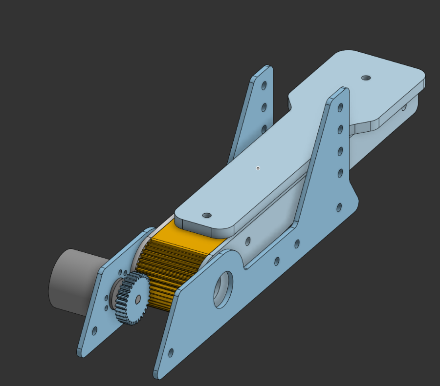
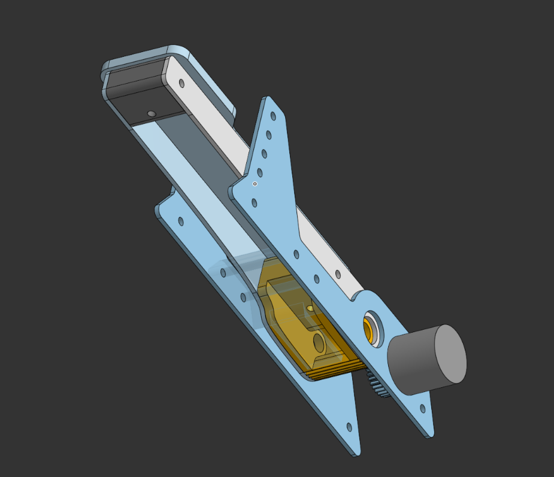
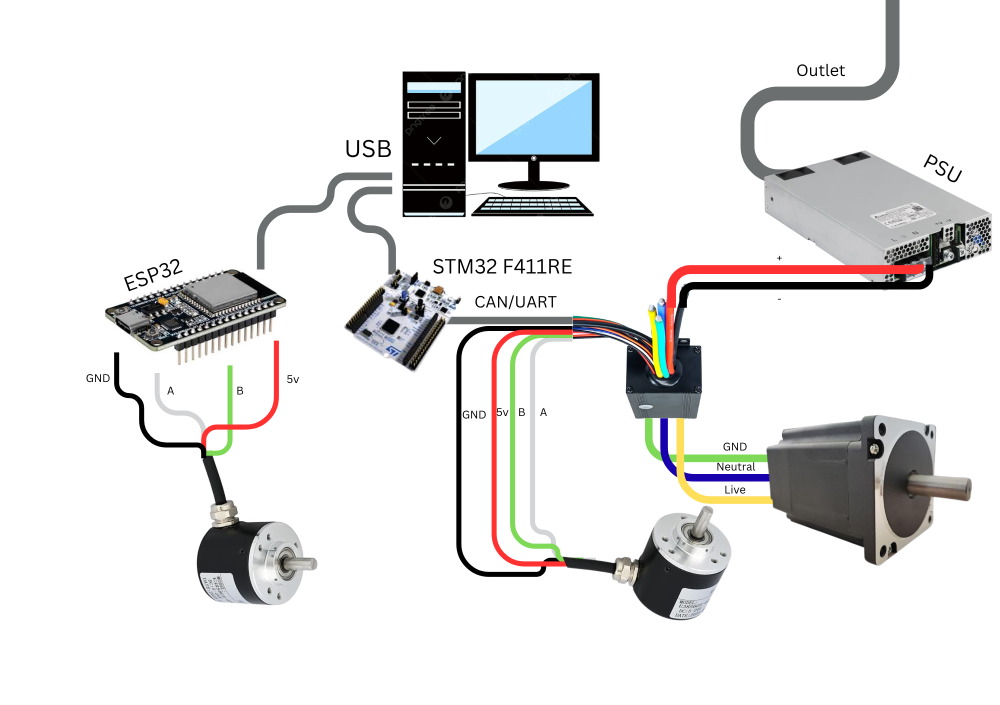

# DIY Sim Racing Setup
It's no secret that simulation racing setups are ridiculously expensive (with high end setups reaching thousands of dollars!). I sought to create a DIY Sim Racing Setup, using many materials I and other hobbyists would already have access to, equipped with a force-feedback wheel and 3-pedal setup. In addition, I aimed for the wheel base to be very compact while offering a driving experience comparable to mid-range setups, for a far cheaper cost.

## Specs
The [Wheelbase](CAD/Wheel/Wheel%20Assembly.step) features a 220W 48V Brushless DC Motor for punchy, high-torque force feedback. It reads position through a 600 P/R Incremental Rotary Encoder, which is responsive and accurate. It is also marginally adjustable, with 3 height settings and 10 degrees of adjustability.

The [Pedals](CAD/Wheel/Pedal%20Assembly.step) feature torsion springs, adjustable end-stops, and rotary encoders.

# Zine

_Side note:_ I will update this Zine with an IRL picture as soon as I build it

## Design Philosophy:
While I do have many years of experience on an FTC robotics team (Roboavatars #7303), I am fully a software member. This project was my first attempt at CADing and building a physical project from scratch! Keep this in mind as you read through these designs, and please let me know at kaidenashvini@gmail.com of any mistakes I may have made!

Remember, while I have flushed out a completed project that works for me, feel free to adapt to whatever materials you have on hand. This will keep costs very low, as it did in my case, and will make your personal project far more convenient to complete!

1. ### [Wheelbase](CAD/Wheel Assembly.step)
    - **Using 20x20 Extrusions**
        - I have access to plenty of these 20x20 McMaster-Carr extrusions through my robotics team. They are cheap, rigid, and very convenient.
    - **Front Mount**
        - My CAD features a strange design for mounting the force-feedback motor, as it recesses the motor by a few inches. This provides clearance for the inclusion of a shaft coupler (neccesary to extend the motor shaft to mount a 25mm pulley), and it also provides a sturdier rear mounting position.
    - **Motor Rear Mount**
        - The Motor Rear Mount serves to reinforce the motor mount, as features two 3/8ths inch aluminum plates.
    - **Encoder Rear Mount**
        - I geared the encoder to directly to the drive shaft, and found a convenient place to mount it. The mount also keeps the extrusions in place.
        - Gearing an encoder, in my opinion, is preferential to belting it. Gearing will have less lag/backlash, and are also easier to 3d print
    - **3D Printed Pulleys**
        - Metal pulleys are better in *nearly* every way, **but there are a few reasons I chose to 3D print them**. I chose 3D printed pulleys to keep costs down, and because it makes mounting the wheel way easier. I made mine out of annealed carbon nylon (which many have reported online to be very sturdy!), and the design features embedded nuts and space to attach a flange coupler for compactness.
    - **Flipsky Vesc Control**
        - This motor controller is common, and it is listed as compatible with the firmware I've decided to go with for this project. They are relatively common, and I had one on hand. In reality, any controller works as long as it's compatible with the firmware listed in [Software](firmware/README.md).

2. ### [Pedals](CAD/Pedal Assembly.step)
    - **Using Torsion Spring**s
        - I have torsion springs beneath the pedal shafts, which aim offer a realistic feel similar to real pedals.
    - **Pedal Design/Sizing**
        - I based the pedal sizes off of real pedals from IRL car pedals. This (hopefully) makes it easy to heel-toe.
    - **Reading Pedal Position**
        - I chose to use a geared 3D print for low-latency and high-accuracy (by using gear ratios to my advantage)

## Adaptation:
This is a fully-flushed out project that I've put together. I used the resources that I have available to create the best product I could within a reasonable cost. However, I understand that not everyone will have access to the exact same tools and materials as I did. In this case, **IMPROVISE**.

When this project is shipped, an [Adaptation Guide](CAD/README.md) will be added.

## Building Tips:
1. ### Wheel Base
    1. Tapping your Extrusions
        - Use a M5 tap, and preferably a drill press, to tap the ends of your extrusions. For the 1/2 ft extrusions, do it for both sides. Otherwise, tap as neccesary
        - Use a cutting fluid or lubricant, I used WD-40
        - **Take your time**, make sure these come out straight
    2. Printing
        - You will want to print each of these parts to the most sturdy setting you can, with the strongest material you have available, especially if you aren't using the reinforcement plates.
    3. Assembly
        - Mount the Rotary Encoder to the [Encoder Rear Mount](CAD/Wheel/Steering Column Rear Mount.step) (this may be a bit tricky, just keep trying)
        - Mount the [Encoder Rear Mount](CAD/Wheel/Steering Column Rear Mount.step) to 4 tapped extrusions
        - Slide the [Rear Motor Mount](CAD/Wheel/Rear Motor Mount.step) into the 4 tapped extrusions. Slide the BLDC motor in, as well
        - Mount the [Front Motor Mount](CAD/Wheel/Steering Column Front Mount.step) to the other side of the 4 tapped extrusions. Screw in the 4 motor mounting screws.
        - Attach Flange Bearings (Flange facing outward) to the [Front Motor Mount](CAD/Wheel/Steering Column Front Mount.step) and [Endstop](CAD/Wheel/Steering Column Rear Mount.step)
        - Slide the 12mm dia. x 400mm length D-shaft into the bearings. Mark enough clearance for the Hub Adapter and Shaft Gear (including the flange coupling)
        - Cut the shaft to size. Drop the 14mm x 12mm Shaft Coupler into the top of the Front Motor Mount, and take the smaller peice of the D-shaft to attach to the end of the Shaft Coupler
        - Assemble the gears and pulleys ([Hub Adapter](CAD/Wheel/Hub Adapter.step), [Motor Pulley](CAD/Wheel/Motor Pulley.step), [Shaft Gear](CAD/Wheel/Shaft Gear.step), [Encoder Gear](CAD/Pedal/Encoder Gears.step)) using M4 nuts/bolts and the Flange Coupler
        - Test fit and mark the position of the Flange Couplings on the shafts. Disassemble the Pulleys/Gears
        - Attach the Flange Couplings with the shaft mounted and tighten
        - Attach the Gears/Pulleys to their respective Flange Couplings
        - Attach the Belt. This may be easier if you detach the motor output shaft and steering column shaft and slide both in at the same time with the pulley in place
        - Attach the [Encoder Gear](CAD/Pedal/Encoder Gears.step) to the encoder
    4. Wiring
        - Use a spare power cord. Strip and attach ferrules to the end. Apply to Power Supply Unit
        - Motor wires to VESC (color corresponding wires)
        - PSU wires to VESC (color corresponding RED/BLACK 10-12 gauge wires)
        - COMM TX/RX/GND wires to STM32 (check wiring diagram for the color correspondance). Ensure that TX/RX are crossed!!
        - Attach 4.7k ohm pull-up resistors to a small jumper wire to both the A and B (Green/White) wires. I used Dupont wires for easy connection.
        - Attach GND,A,B,5v to encoder. Attach the small jumper wire from the previous step to a 3.3V output
        - Splice a USB cable (data transfer, must have 4 wires) with Dupont wires. Refer to your STM32's pinout for the placement of USBs

2. ### Pedals
    1. Side Walls
        - I CNCed my side walls with either aluminum or polycarbonate. You can even print them, although I cannot guarantee their longevity.
    2. Assembly
        - Shave any excess burr or debris off the 3D prints and CNC cuts
        - Mount the Rotary Encoder to a [Pedal Wall](CAD/Pedal/Pedal Base.step)
        - Mount 2 Hex Standoffs to a pair of [Pedal Walls](CAD/Pedal/Pedal Base.step), one at the hole next to the Rotary Encoder and one on the desired end position
        - Mount the rest of the parts in the [Pedal](CAD/Pedal/Pedal%20(1).step)
    3. Wiring
        - Wire the encoder to 5V, GND, 2 GPIO pins on the ESP32 (internal pull-ups)

**A visual build guide is soon to come, as soon as I document the building process (after approval)**

## Software
Many high-quality DIY sim setups utilize and [OpenFFBoard](https://github.com/Ultrawipf/OpenFFBoard), which comes with all of the force-feedback control that communicates with popular sim games. However, OpenFFBoards are priced at $160, and are produced in Germany. They are fantastic products with great quality, and their software is unmatched in the DIY niche. However, for one reason or another, not everyone can get easy access to one of these boards. Instead, I rely on an ABI encoder-compatible FlipSky VESC controller, which I connect to a cheap power-supply. I also rely on an inexpensive STM32 board.

I implemented custom Force-Feedback and USB HID firmware by adapting the [VNWheel](https://github.com/hoantv/VNWheel) opensource project. This proved to be an immensely difficult task, because the TinyUsb 

This has many implications for developing software, though. The pedals will require seperate microcontrollers. I went with some old ESP32s I had lying around, and also borrowed a RP2040. I wanted to create firmware for multiple MCUs, so that you can use whatever one you want. Either way, both firmwares should be easy to adapt.

### ESP32 (w/out USB HID)
Older ESP32s do not have the correct hardware to support native USB HID, so I designed a way to read serial inputs. If you are using an RP2040 or more expensive/newer ESP32s, the USB HID interfacing should be extremely straightforward.

I will also add support for the newer ESP32s and RP2040s as soon as I get my hands on them.

### Electronics

### BOM
About half of the cost in materials was self-sourced from previous projects, robotics teams, friends, etc. Shoutout to Theodore for challenging me to make a build for the same cost.

Learn more in [Adaptation Guide](CAD/README.md).

The BOM can be found [here](BOM/BOM.csv).

### Contact

Discord: sheikaheye123

Gmail: kaidenashvini@gmail.com