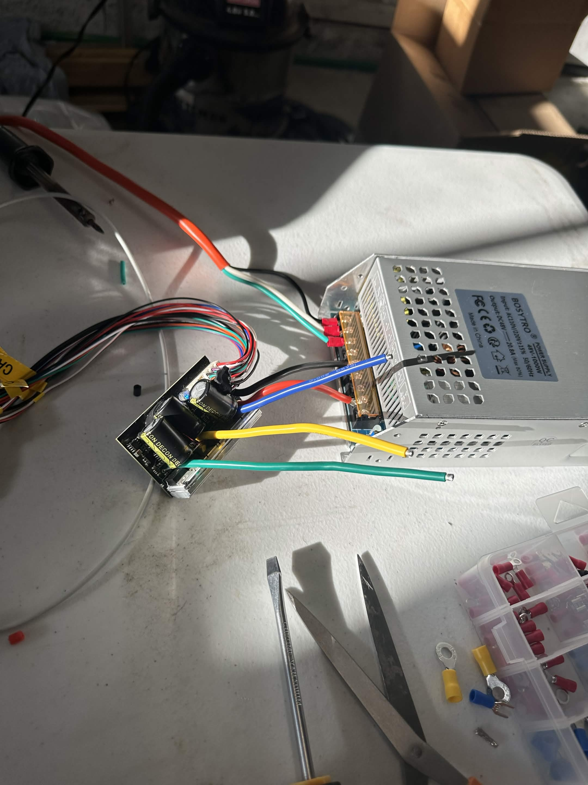
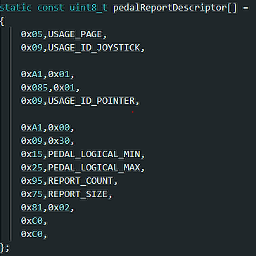

# Software

## IMPORTANT DISCLAIMER!!
The current firmware is **not** complete, **but for a very good reason**. Configuring a VESC requires the motor and encoder to be in a completed build (to tune encoder offset and ratio for external encoder setups). I am currently waiting on some of my parts to be machined. **This section will be updated with a complete firmware/software guide in 1-2 days!!** I did not want to start fully building before I submit the project!!

I have wired the VESC and configured as much of the VESC tool as possible, but need the completed build to test it. In the meantime, enjoy this picture of my VESC in beautiful lighting (it is my first time soldering anything big as well :P):

Otherwise, the software for the firmware is complete, but untested, for the ESP32s.

## Third Party Libraries

| Library     | Usage | Link |
|-------------| - | - |
| Serialib    | Allows C++ to read serial input from ESP32 | https://github.com/imabot2/serialib | 
| vJoy SDK    | Allows C++ USB HID interfacing for joystick inputs | https://sourceforge.net/projects/vjoystick/files/Beta%202.x/SDK/ |
|  hidapi-win | Allows low-level USB HID interfacing | https://github.com/libusb/hidapi |
| VNWheel | Open-source Force Feedback for Arduinos | https://github.com/hoantv/VNWheel |
 | TinyUSB | HID interfacing with the STM32 | https://github.com/hathach/tinyusb |

## Building

You will need to put the vJoyInterface.dll (specifically from third-party/vjoy/lib/amd64/) in the cmake-build-debug folder (for CLion, should be wherever your .exe file is).

I will remove this soon, because I need to flush out the firmware with the physical parts before completing it.

## Future Work (Coming Soon)

After completing the build, I will add support for newer ESP32s and RP2040s for pedal controls, as well. I need to source these myself to solidly test them, so I cannot configure them just yet.

I have written some low-level USB HID Descriptors for this task, included in the image below:

**Expect a full firmware/build guide once the build is started/completed!**

## Sources (Arduino IDE Sketches for ESP32 Firmware):

I used this tutorial to read ABI encoder outputs: https://www.youtube.com/watch?v=Y6BjnfwfzKE

## DIY Force-Feedback software
While originally not my intention, I ended up adapting the VNWheel library to implement custom force-feedback firmware to the STM32. This will be explained more in depth in the demo video (once it is shipped)